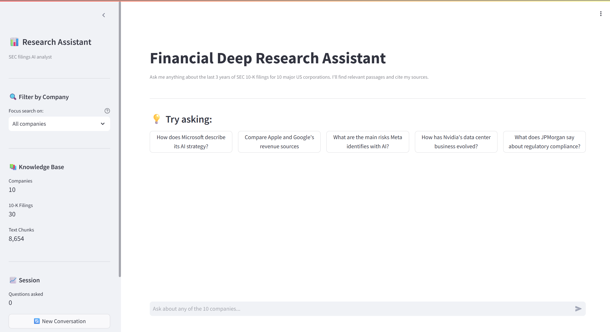
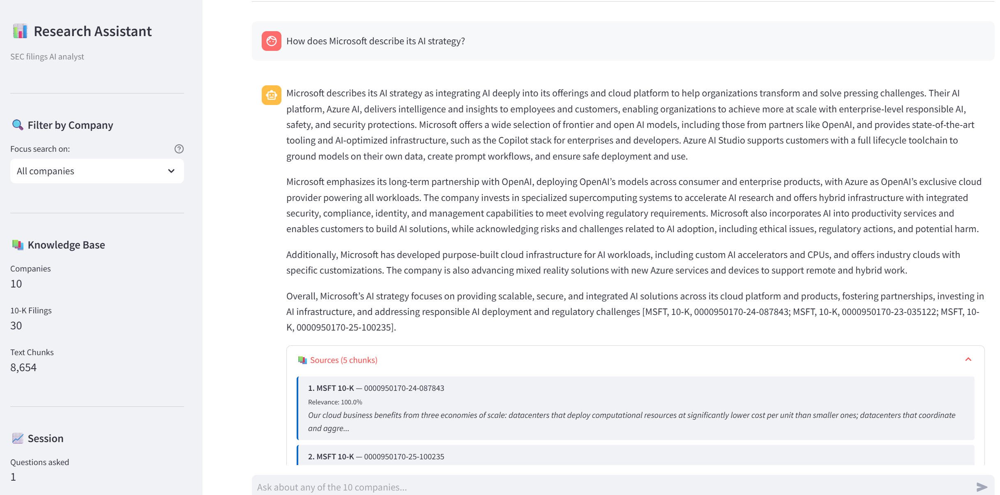
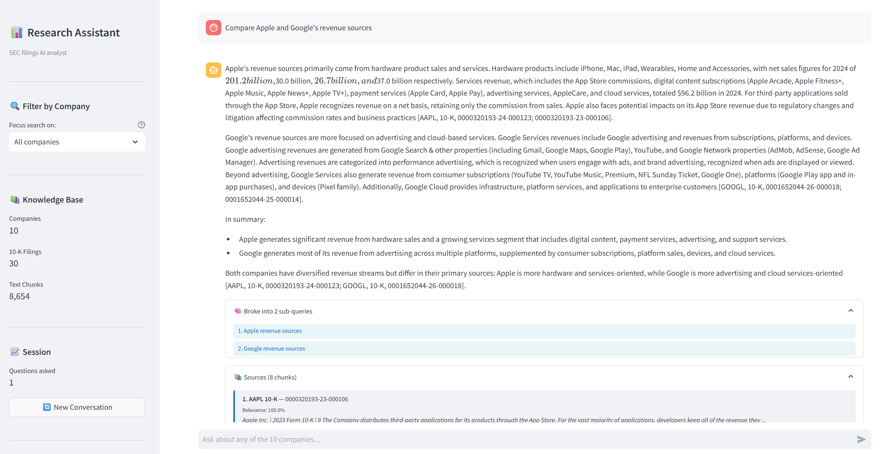

# Financial Deep Research Assistant

> Production RAG system answering analyst-grade questions over SEC 10-K filings.  
> Multi-step LangGraph agent with hybrid retrieval, query decomposition, chunk grading and answer reflection.  
> Deployed live on Azure.

🔗 **Live demo:** https://financial-research-assistant.salmonwave-71cee0aa.swedencentral.azurecontainerapps.io/  
📊 **Evaluation:** 98.4% retrieval precision · 98.8% keyword coverage (21 questions across 4 categories)  
🛠️ **Stack:** Python · LangGraph · Azure OpenAI · ChromaDB · BM25 · Streamlit · Docker · Azure Container Apps



---

## What it does

Answers analyst-grade questions about US public companies by retrieving from their SEC 10-K filings. Returns answers with inline citations, refuses out-of-corpus questions to prevent hallucination and exposes the agent's reasoning in real time via a streaming UI.

The corpus covers 10 mega-cap companies: MSFT, AAPL, GOOGL, NVDA, META, AMZN, TSLA, JPM, V, UNH.

### Example: substantive analyst-grade answers with citations

The agent retrieves relevant passages, synthesizes a structured response, and provides inline citations to specific 10-K filings:



### Example: query decomposition for multi-entity questions

For comparison or aggregation questions, the agent decomposes the query into sub-queries handled in parallel:



### Example: honest refusal on out-of-corpus questions

> *"What is Tesla's quarterly dividend payment?"*

Tesla doesn't pay a dividend — the agent recognizes the absence in retrieved context and refuses rather than hallucinating a number.

---

## Architecture


**Deployment:** Docker → Azure Container Registry → Azure Container Apps (Sweden Central, scale-to-zero)  
**LLM:** Azure OpenAI (gpt-4.1-mini) with OpenAI direct fallback via configuration toggle  
**Embeddings:** Azure OpenAI text-embedding-3-small

### Key design decisions

- **LangGraph over plain LangChain RAG.** The agent isn't a linear chain — it's a state machine with conditional routing. Chunk grading and answer reflection both feed retry loops that broaden the search rather than ship weak answers. Two retry paths: one if retrieved chunks fail relevance grading, another if the synthesized answer fails quality reflection.

- **Hybrid retrieval (semantic + BM25).** Pure semantic search underperforms on exact-match terms like ticker symbols, accession numbers, and specific dollar figures. BM25 catches them; cosine similarity catches paraphrases.

- **Cross-encoder re-ranking — tested and rejected.** I implemented and evaluated cross-encoder re-ranking on retrieved chunks. It hurt evaluation metrics — cross-encoders trained on web search don't transfer well to dense, jargon-heavy financial filings where chunks contain similar terminology. Removed in favor of hybrid search alone.

- **Structured outputs via Pydantic.** All LLM decision points (`QueryPlan`, `ChunkGrading`, `QualityAssessment`) use `with_structured_output()` for reliable parsing. No string-matching on LLM responses.

- **Honest refusal as a first-class outcome.** The reflection node is prompted that "an honest refusal is a GOOD answer when context is genuinely weak." Hallucinating is treated as worse than refusing. Refusal scores high and doesn't trigger retry.

- **Multi-provider LLM toggle.** Configuration switches between Azure OpenAI (enterprise) and OpenAI direct (development) without code changes.

- **Streaming UI with visible reasoning.** A separate streaming entry point (`ask_streaming`) emits status events (planning, searching, generating) plus token-level streaming for the final answer. Users see agent progress in real time.

---

## Evaluation

Tested across 21 questions covering single-company queries, multi-company comparisons, aggregations, and out-of-corpus refusal cases.

### Overall

| Metric | Score |
|---|---|
| Retrieval precision | **98.4%** |
| Keyword coverage | **98.8%** |
| Avg response time | 9.2s |
| Correct refusal rate (out-of-corpus) | 75% (3 of 4) |

### By category

| Category | Questions | Retrieval | Keywords |
|---|---|---|---|
| Factual | 10 | 100% | 98% |
| Comparative | 4 | 100% | 100% |
| Aggregation | 3 | 89% | 100% |
| Unanswerable | 4 | 100% | 100% |

**Methodology:**
- *Retrieval precision* — fraction of expected company tickers found in retrieved chunks
- *Keyword coverage* — fraction of expected facts/terms appearing in the generated answer
- *Correct refusal rate* — fraction of out-of-corpus questions where the agent correctly refused instead of hallucinating

Full evaluation framework, question set, and per-question results: [`/tests/`](./tests/)

---

## Quick start

**Prerequisites:** Python 3.12+, Azure OpenAI access (or OpenAI API key)

```bash
git clone https://github.com/[your-username]/financial-research-assistant.git
cd financial-research-assistant
python -m venv venv && source venv/bin/activate
pip install -r requirements.txt
cp .env.example .env  # add credentials
streamlit run app.py
```

App will be available at `http://localhost:8501`.

To rebuild the vector store from raw SEC filings:
```bash
python -m src.ingest
```

---

## Tech stack

**LLM & embeddings:** Azure OpenAI (gpt-4.1-mini for generation, text-embedding-3-small for embeddings)  
**Retrieval:** ChromaDB, BM25, hybrid scoring  
**Agent framework:** LangGraph, LangChain  
**Validation:** Pydantic structured outputs  
**UI:** Streamlit with token-level streaming  
**Infra:** Docker, Azure Container Apps, Azure Container Registry  
**Data:** SEC EDGAR 10-K filings (10 mega-cap companies, fiscal years 2023-2025)

---

## Limitations

Honest list of what the system doesn't do:

- **Corpus is bounded.** 10 companies, fiscal years 2023-2025. Out-of-corpus questions correctly refused but the system can't answer about other companies, periods, or document types.
- **Refusal isn't perfect.** Measured 75% (3 of 4) correct refusal on out-of-corpus questions in the evaluation set. One question slipped through; debugging that case is a planned improvement.
- **Small evaluation set.** 21 questions provides directional signal; production-grade evaluation would require 200+ questions across more diverse query types.
- **English-only.** SEC 10-K filings are English-language documents.
- **Cold start latency.** Azure Container Apps scale-to-zero introduces ~30s cold start on first request. Production would require warm replicas.
- **No conversation memory.** Each query is independent — no follow-up reasoning across turns.
- **No fine-tuning.** Pure RAG approach. For domain-specific terminology accuracy, fine-tuning the embedding model would be a logical next step.

---

## What's next

- Debug the one out-of-corpus question that slipped through refusal
- Expand corpus to include 10-Q quarterly filings and 8-K material events
- Conversation memory for multi-turn analyst workflows
- Larger evaluation set with structured question taxonomy
- Cost and latency observability dashboard
- A/B framework for retrieval and prompt experiments

---

## License

MIT
